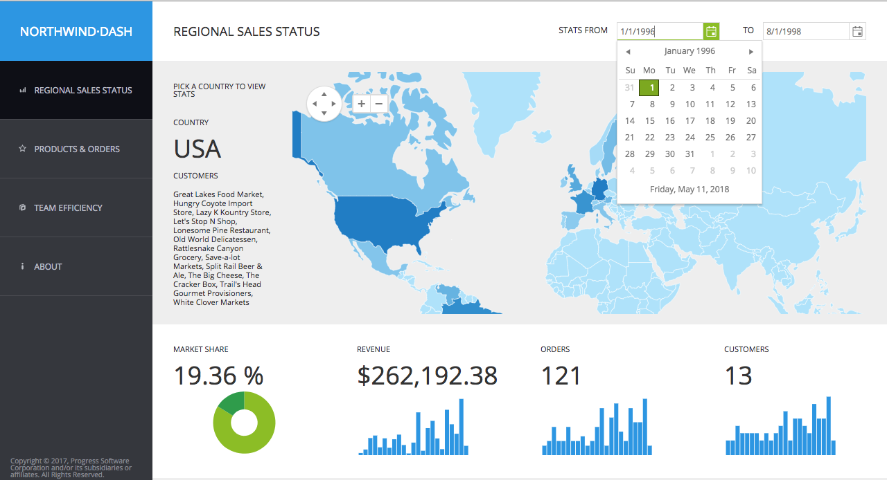

# Intro

Jika istilah UI framework masih terlalu abstrak, maka anggap saja **Kendo UI ini adalah sekumpulan komponen \(library\) untuk membuat antarmuka web** yang lebih interaktif seperti layaknya aplikasi desktop.

Kendo UI menyediakan lebih dari 70 komponen siap pakai mulai dari datepicker, autocomplete, calendar, navigasi, chart, treeview, splitter, hingga spreadsheet. Dengan menggunakan Kendo UI diharapkan proses development menjadi lebih cepat, lebih menyenangkan bagi programmer, dan menghasilkan software yang konsisten dari sisi user experience.

## Kendo UI vs Bootstrap

Bootstrap merupakan pilihan paling populer saat ini untuk membangun antarmuka **website**. Sekali lagi, **website**. Pada awalnya memang Bootstrap disiapkan untuk membangun sebuah website, dengan senjata utama responsive dan pre built components yang memang disiapkan khusus untuk sebuah website seperti navigasi, grid, button, table, dan lain-lain.

Pada perkembangannya, Bootstrap juga populer untuk membangun aplikasi berbasis web. Developer dari penjuru dunia membuat template \(theme\) yang menarik dengan menambahkan berbagai macam library \(plugin\), comot sana-sini, diseragamkan tampilannya, sehingga bisa digunakan untuk membangun aplikasi berbasis web dengan cepat dan mudah.

 Sampai pada level dimana aplikasi yang kamu kembangkan masih "biasa-biasa" saja, tipikal CRUD yang tidak terlalu butuh tampilan canggih dan interaksi yang rumit, maka Bootstrap masih menjadi pilihan utama.

Namun ketika kamu membutuhkan tampilan yang lebih "rich", interaktif, serta konsisten seperti layaknya aplikasi berbasis desktop, maka Kendo UI menjadi pilihan yang lebih bijak.

Beberapa komponen yang sudah tersedia \(built in\) di Kendo UI dan tidak tersedia di Bootstrap antara lain:

* Spreadsheet
* Datagrid
* Tree
* Pivot table
* Chart
* Splitter
* Media player
* Drag and drop
* Gantt chart
* Calendar
* Map

Komponen-komponen di atas tentunya jarang dijumpai di sebuah aplikasi CRUD sederhana, namun bukan berarti tidak dibutuhkan. **Sebagai seorang developer, kita punya tanggung jawab moral untuk menghasilkan aplikasi yang lebih baik dan nyaman digunakan penggunanya. **Memanfaatkan Kendo UI adalah salah satu cara yang bisa ditempuh.


Kendo UI = jQuery UI = Bootstrap + tons of plugins, hanya saja Kendo UI lebih lengkap, konsisten, dan robust.



Tidak menutup kemungkinan juga menggabungkan Kendo UI dan Bootstrap sekaligus, dimana Bootstrap digunakan untuk melakukan layouting tampilan dan handle responsiveness dan Kendo UI fokus untuk setiap komponen UI.


